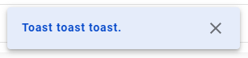
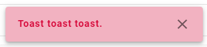

# Description

## Props
| Props         | Type                                            | Description                                                                                        |
|---------------|-------------------------------------------------|----------------------------------------------------------------------------------------------------|
| `message`     | `string&#124;JSX`                               | boolean, favorite status                                                                           |
| `type`        | `'success'&#124;error'&#124;'custom'`           | type of toast                                                                                      |
| `closeButton` | `{isShow?: boolean, styles?: SerializedStyles}` | show/hide close button, custom css closeButton                                                     |
| `option`      | `import {ToastOptions} from 'react-hot-toast'`  | options of [react-hot-toast](https://react-hot-toast.com/docs/toast), at "Available toast options" |

## UI
- Success

  
- Error

  
- In case custom, you can custom toast UI following design.

# How to use
Basic
```tsx
import {toastHandler} from 'contexts/ToastContext'

// ...
// when you need to toast
toastHandler({
  message: 'Test test test',
  type: 'success',
})
```
Custom with JSX
```tsx
import {toastHandler} from 'contexts/ToastContext'
import {Stack} from '@mui/material'
export function InfoToast(props: {text: string}) {
  return <Stack direction="row" justifyContent="space-between" alignItems="center">{props.text}</Stack>
}

// ...
// when you need to toast
toastHandler({
  message: () => <InfoToast text={'You text'}/>,
  type: 'success',
  closeButton: {isShow: false},
  option: {
    position: 'bottom-center',
  },
})
```

#### HERE IS COMPLETED EXAMPLE CODE:
To DEMO this example, you can paste below code to file `pages/index.tsx`
```tsx
import {toastHandler} from 'contexts/ToastContext'
import {Stack} from '@mui/material'
import {SurfaceLayout} from 'components/layouts'

export function InfoToast(props: {text: string}) {
  return <Stack direction="row" justifyContent="space-between" alignItems="center">{props.text}</Stack>
}

export default function Index() {
  const onClick = () => toastHandler({
    message: () => <InfoToast text={'Toast toast toast.'}/>,
    type: 'error',
  })
  return <button onClick={onClick}>Click me. Please!!!</button>
}

Index.Layout = SurfaceLayout
```

# About folder `common-options`
In case you need custom a toast for **common**

You can place custom options at `packages/skijan/contexts/ToastContext/common-options`
### Example:
- Place custom options at `packages/skijan/contexts/ToastContext/common-options/my-toast`.
```tsx
import {Stack} from '@mui/material'
import {TMainToast} from '../index'

export const options: TMainToast = {
  message: (
    function MyToast(props: {text: string}) {
      return <Stack direction="row" justifyContent="space-between" alignItems="center">{props.text}</Stack>
    }
  ),
  type: 'custom',
  closeButton: {isShow: false},
  option: {
    duration: Infinity,
    position: 'bottom-center',
  },
}
```

- And use it
```tsx
import {toastHandler} from 'contexts/ToastContext'
import commonToastDefault from 'contexts/common-options/my-common'

// ...
// when you need to toast
toastHandler(commonToastDefault)
```
